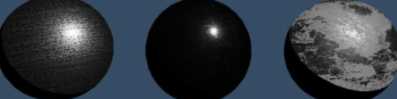

# <center>PBR</center>
<!--
[toc]
-->
[能量守恒](#能量守恒)
[工作流程](#工作流程)
[Roughness](#Roughness)
[镜面反射](#镜面反射)
[反射](#反射)
[F0](#F0)

---
# 1. 发展历史
## Phong（1973年）
## Cook-Torrance（1982年）
## Oren Nayarh（1994年）
## Schlick（1994年）
模型简化了Phong模型的镜面反射中的指数运算

$$
F_0 = (\frac{n1-n2)}{n1+n2})^2
$$

$$
FSchlick(h,v,F_0) = F_0 + (1 - F_0)(1 - (h*v)^5
$$


## GGX（2007年）
将微平面反射模型推广到表面粗糙的半透明材质
同样适用于渲染表面粗糙的不透明物体

## Disney principled BRDF, (2012年)
《Physically Based Shading at Disney》
艺术导向（Art Directable）的着色模型，而不完全是物理正确（Physically Correct

## 现阶段的BxDF（2019年）

> UE4渲染出的虚拟人Siren。综合了**分层材质**、**混合材质**、**混合BxDF**、**眼球毛发**和**皮肤渲染**等新兴技术。
- PBR Diffuse for GGX + Smith (2017)
- MultiScattering Diffuse (2018)
- Layers Material（分层材质）
- Mixed Material（混合材质）
- Mixed BxDF（混合BxDF）
- Advanced Rendering（进阶渲染）

--- 
<span id="概念"></span>

# 概念


## 


---
# 2. 材质

| 材质(Material)           | 基础色强度(BaseColor Intensity) |
| ------------------------ | ------------------------------- |
| 木炭(Charcoal)           | 0.02                            |
| 新沥青(Fresh asphalt)    | 0.02                            |
| 旧沥青(Worn asphalt)     | 0.08                            |
| 土壤(Bare soil)          | 0.13                            |
| 绿草(Green Grass)        | 0.21                            |
| 沙漠沙(desert sand)      | 0.36                            |
| 新混泥土(Fresh concrete) | 0.51                            |
| 海洋冰(Ocean Ice)        | 0.56                            |
| 鲜雪(Fresh snow)         | 0.81                            |

<span id="粗糙度"></span>

## 粗糙度 (Roughness)  

- 材质表面的微小结构对于反射光线的扰动，来描述材质表面的微小平面的平整程度
- 用于描述材质表面的微小结构对其光学特性的影响
- 凹凸不平的表面对入射光和反射光造成的遮蔽效果，微小的阴影，这些阴影甚至存在在物体面向光源的那个部分
- 代替高光因子
- AO模拟微小表面产生的细小阴影
- 0表示材质表面是光学光滑的，就是表面没有任何凹凸不平；
- 1则表示材质表面凹凸不平的程度相当大，基本上难以形成可见的镜面反射（不会形成光斑）


为1时表示最粗糙的表面，完全没有任何高光反射
R=1, 粗糙物体，无反射
R=0, 光滑物体，全反射

**粗糙度0~1变化**
- 越粗糙材质高光反射越不明显
- 金属roughness：极光滑镜面，反射极清晰
- 非金属roughness：表面较细腻，有竹纹理，略粗糙防滑处理


| 材质     | 粗糙度      | 描述                                   | 效果                    |
| -------- | ----------- | -------------------------------------- | ----------------------- |
| 金       | 0.02 ~ 0.10 | 极光滑镜面，反射极清晰                 |        |
| 竹制地板 | 0.30 ~ 0.40 | 表面较细腻，有竹纹理<br>略粗糙防滑处理 |  |
| 锈铁     | 0.70 ~ 1.00 | 无光斑，有一些微小结构                 |      |


## 金属度（Metallic）

- 0是电介质（绝缘体），1是金属。金属没有漫反射，只有镜面反射。 

## 镜面度（Specular）

- 表示材质的镜面反射强度，从0（完全无镜面反射）~1（完全镜面反射。UE4的默认值是0.5。
- 万物皆有光泽（镜面反射），对于强漫反射的材质，可通过调节粗糙度，而不应该将镜面度调成0。
- 

| 材质(Material) | 镜面度(Specular) |
| -------------- | ---------------- |
| 草(Glass)      | 0.500            |
| 塑料(Plastic)  | 0.500            |
| 石英(Quartz)   | 0.570            |
| 冰(Ice)        | 0.224            |
| 水(Water)      | 0.255            |
| 牛奶(Milk)     | 0.277            |
| 皮肤(Skin)     | 0.350            |


------
<span id="工作流程"></span>

# 工作流程

## 金属流程
  
- BaseColor（基础色）：亮不超过240，暗不低于30-50，不包含其他光照信息。金属反射率应在70%~100%，也就是说180~255
- MetallicMap（金属度）：1为金属，0为非金属，低于235，BaseColor应该也低些
- RoughnessMap（粗糙度）：，改变光的方向，不改变光的强度，粗糙的图光线会大而暗，0为光滑光线会小而亮

## 高光流程
  
- Diffuse，亮不超过240，暗不低于30-50，不包含反射信息，可以带Micro-Occlusion. 纯金属没有颜色，油漆和锈迹要带- 颜色
- Specluar（高光图）
- Glossiness（光滑度图）
- Ambient Occlusion（影响Diffuse部分）
- HeightMap视察映射
- NormalMap

------
# 名词


<span id="F0"></span>
# F0
  反射率
  金属时F0为Albedo，非金属时为0.04。
  
------
<span id="反射"></span>

# 反射

## 镜面反射
- **[D](#NDF)** 表示微表面分布函数(Normal Distribution Function) Trowbridge-Reitz
- **[G](#G)** 表示阴影系数
- **[F](#F)** 表示菲涅尔系数，不同的表面角下表面所反射的光线所占的比率。
  
*F和G是几何光线衰减*

```c++
  float D = GGXTerm (nh, roughness);
  float G = SmithJointGGXVisibilityTerm (nl, nv, roughness);
  float F = FresnelTerm (specColor, lh);
  // 镜面反射 
  spec = G * D  * F * nl * light.color
  giSpec = surfaceReduction * gi.specular * FresnelLerp (specColor, grazingTerm, nv)
```

## **漫反射**
- 散射出来的光是均匀分布的，所以只与法线和光线有关
- 漫反射有被折射的比例如Kd，接收的光量和nl成正比
- 镜面反射有被反射的比率Ks
- 漫反射
  ```c++
  diffColor * (gi.diffuse + light.color * diffuseTerm)
  ```


| -            | **直接光照**       | **间接光照**       |
| ------------ | ------------------ | ------------------ |
| **漫反射**   | 直接光源的漫反射   | 间接光照的漫反射   |
| **高光反射** | 直接光照的高光反射 | 间接光照的高光反射 |

[直接光照的高光反射](#直接光照的高光反射)


| 光源     |                                                    |            |
| -------- | -------------------------------------------------- | ---------- |
| 直接光照 | 来自于场景光源直接照射的部分                       | 光源有限   | 可遍历采样   |
| 间接光照 | 来自于物体反射或者大气散射等的光能，物体所反射的光 | 大面积的光 | 无法遍历采样 |

| 光学性质     |                                                    |            |
| ------------ | -------------------------------------------------- | ---------- |
| **漫反射**   | 来自于场景光源直接照射的部分                       | 光源有限   | 可遍历采样   |
| **高光反射** | 来自于物体反射或者大气散射等的光能，物体所反射的光 | 大面积的光 | 无法遍历采样 |

# 直接光照的高光反射
[BRDF](BRDF.md)

反射方程


| 符号 | 名称     | 解析                                               | 公式                                         |                   | 单位                        | 解析                                                              |
| ---- | -------- | -------------------------------------------------- | -------------------------------------------- | ----------------- | --------------------------- | ----------------------------------------------------------------- |
| Q    | 辐射能量 |                                                    | -                                            | Radiant energy    | 焦耳(J)                     | 电磁辐射的能量                                                    |
| Φ    | 辐射通量 | 一个光源输出的能量                                 | \(\Phi = \frac{dQ}{dt}\)                     | Radiant Flux      | 瓦(W)                       | 单位时间辐射的能量，也叫辐射功率(Radiant Power)或通量(Flux)       |
| ω    | 立体角   | 球体上的一个截面的大小或者面积，一个带有体积的方向 | \(\omega = \frac{S}{r^{2}}\)                 | Solid Angle       | 立体弧度、球面度(sr)        | 是二维度在三维的扩展，1球面度等于单位球体的表面积                 |
| I    | 辐射强度 | 一个光源向每单位**立体角**所投送的辐射通量         | \(I = \frac{d\Phi}{d\omega}\)                | Radiant Intensity | 瓦/立体弧度(W/sr)           | 通过单位立体角的辐射通量                                          |
| M    | 辐射度   |                                                    | \(M = \frac{d\Phi}{dA}\)                     | Radiosity         | 瓦/平方米(W/m²)             | 离开单位面积的辐射通量，也叫辐出度、辐射出度率(Radiant Existance) |
| E    | 辐照度   | 光的辐射度总和称为辐照度(Irradiance)               | \(\Phi = \frac{d\Phi}{dA_{\perp}}\)          | Irradiance        | 瓦/平方米(W/m²)             | 到达某单位面积的辐射通量                                          |
| L    | 辐射率   |                                                    | \(L = \frac{d^{2}\Phi}{d\omega dA_{\perp}}\) | Radiance          | 瓦/平方米·立体弧度(W/m²·sr) | 通过单位面积单位立体角的辐射通量                                  |

$$
L_o(p, \omega_o) = \int_{\Omega} f_r(p, \omega_i, \omega_o) L_i(p, \omega_i) (\mathbf{n} \cdot \omega_i) d\omega_i
$$


```c++
int steps = 100; // 分段计算的数量，数量越多，计算结果越准确。
float dW  = 1.0f / steps;
vec3 P    = ...;
vec3 Wo   = ...;
vec3 N    = ...;
float sum = 0.0f;
for(int i = 0; i < steps; ++i) 
{
    vec3 Wi = getNextIncomingLightDir(i);
    sum += Fr(P, Wi, Wo) * L(P, Wi) * dot(N, Wi) * dW;
}
```

- Fr：\(f_r(p, \omega_i, \omega_o) \) : 双向反射分布函数(Bidirectional Reflectance Distribution Function, BRDF)
- L：\(L_i(p, \omega_i) \) : 辐射率方程，某个点\(p\) 的辐射率，无线小的立方体角\(\omega_i\)
- dw：\(d\omega_i \) : 离散步长，值越小结果越接近正确的积分函数的面积或者说体积

# BRDF

[BRDF](../BRDF/BRDF.md)

------------------------
# 直接光照的漫反射
- 反射系数:
  - 金属材质：Albedo是反射贴图
  - 非金属材质：Albedo是漫反射贴图
  - 金属材质无漫反射，会吸收掉折射入材质的光线，转换成其他能量，所以直接定义金属的漫反射系数为0，不论高光系数是- 多少
  - 金属材质不需要漫反射贴图，使用漫反射贴图传递反射系数。
  - 反射系数并非线性，使用更多的波段反射系数。

------------------------
# 间接光照的漫反射
间接光的主要特点是其来自于场景当中的各个方向，太多的方向有很大的计算量，导致不能全部使用直接光的方式。
金属没有漫反射，同直接光一样为黑色
间接光使用离线预计算存储到贴图，或近似算法，将所有的各方向的间接光，使用法线方向的单一入射光，所以使用法线采样离线的贴图
感光球，那么这个球的表面上的任何一点就代表了该方向上所有光照的贡献。把这个球表面的光照信息记录下来，就是一张360度无死角的间接光强度查找表
任何一个给定法线方向的表面，其会受到与其法线成-90度到90度这个范围的间接光的影响。这很像中国古代的天圆地方说，地面会受到盖在其上的整个半球形天空的影响。
天空盒
离线计算来事先计算好卷积
贴图生成卷积：在有限分辨率找到我们所关心的半球内的所有像素，根据与法线的夹角加权，累加取加权平均

静态光使用卷积cubemap
动态光使用环境探针LightProbes
对于任意位置，我们使用一定的算法进行内插/外插计算来混合附近的几个样本来模拟

------------------------
# 间接光高光反射
光滑物体的间接光只有一条

# Linear

# ToneMapping

