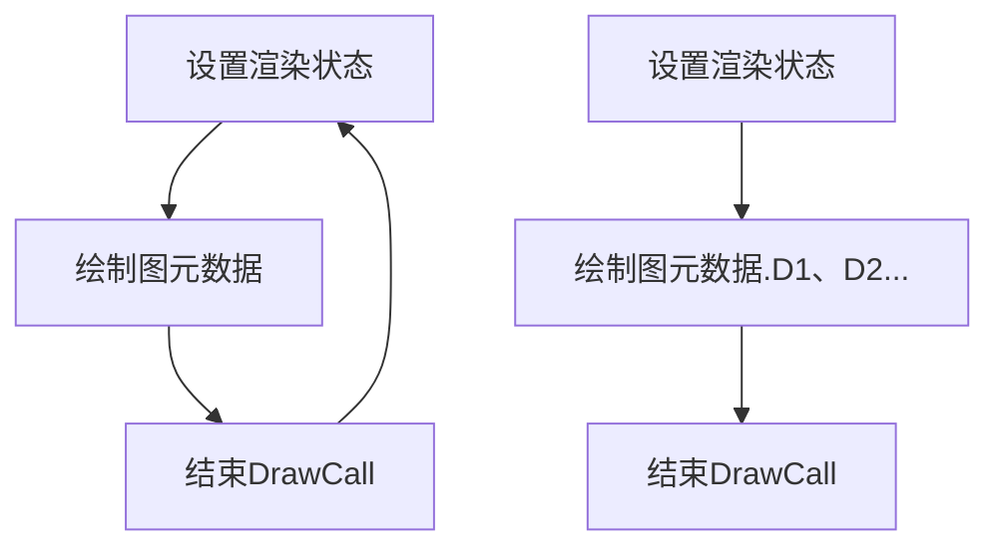
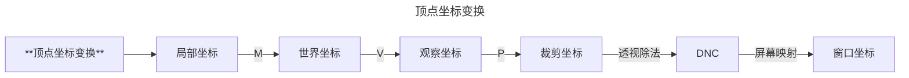
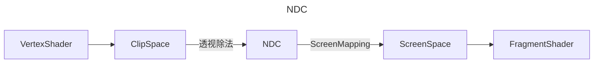
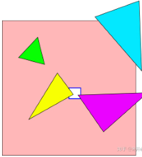
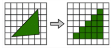
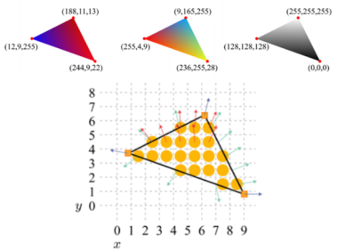
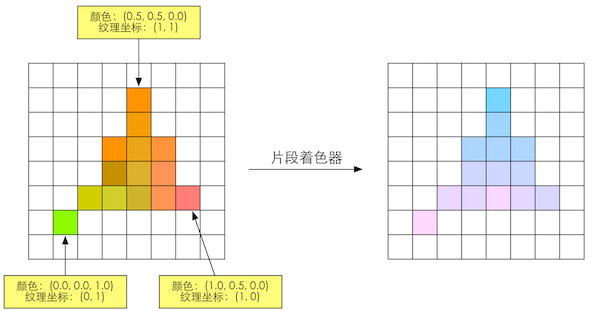
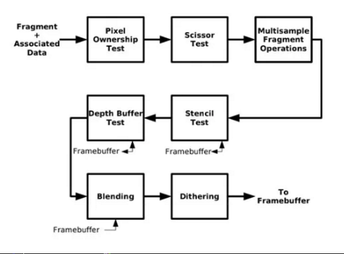
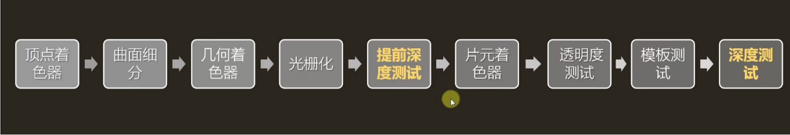

[GitHub](https://github.com/kangyao/Docs/blob/main/Engine/Renderer/Pipeline/RenderPipeline.md)
# <center>渲染管线<center>

- **1.应用阶段**
- **2.几何阶段**
  - **Vertex Shader** 顶点着色器
  - **Gemotry Shader** 几何着色器
  - **投影**
  - **视锥体裁剪**（不可控）
  - **屏幕映射**（不可控）
  - **背面剔除**（不可控）
- **3.Rasterization光栅化**
  - **三角形设置**（不可控）
  - **三角形遍历**（不可控）
- **4.逐像素阶段** (test、blend)
  - **顶点属性插值**（不可控）
  - **PreZ** (opaque+mask) ：只写Depth，不写color
  - **EarlyZ** 光栅化阶段之后，Pixel像素处理阶段之前；深度改为Equal，不写Depth，只写color.. 不开clip；
  - **Pixel Fragment Shader** 插值与像素着色器 计算颜色、Alpha
  - LateZ: 有discard、alpha test, 会“延迟DepthTest/写入”，在Pixel之后DepthTest；否则利用EarlyZ（提前深度测试），先做深度判断再着色。
  - **Test**
    - -> 裁剪测试（AlphaTest/Clip/Discard） clip(alpha - threshold); 或 if (alpha < threshold) discard;
    - -> AlphaTest: 无法在frag之前决定是否剔除， AlphaTest可**在深度测试执行前**在传入片段上运行，根据物体的透明度来决定是否渲染。
    - -> StencilTest: 判断像素是否通过模板缓冲区的规则
    - -> DepthTest: 位于像素处理阶段的测试合并阶段
  - **AlphaBlend** (可配置)经过Test的进入Blend，需要framebuffer混合，无法执行深度测试，写入缓冲区

# <center>1.应该阶段</center>

- ## **任务**
- 输入：场景数据
  - 模型：顶点数据
  - 摄像机坐标
  - 摄像机可见范围视锥体
  - 灯光
- 剔除
- 设置渲染状态、绑定
- 打包数据
- 调用DrawCall
- 输出: **渲染图元**(点线面)

- ## **剔除**

| 剔除       |                                          |
| ---------- | ---------------------------------------- |
| 视锥体剔除 | Camera属性Field of view, Clipping Planes |
| 层级剔除   | CullMask                                 |
| 遮挡剔除   | Occlusion culling                        |


- ## **渲染**

| 渲染概念     | 描述                                                                                       | 对象                                     |
| ------------ | ------------------------------------------------------------------------------------------ | ---------------------------------------- |
| 图元         | 由一系列的Vertex（顶点）来描述 <br>每个顶点包含多个Attribute比如位置、纹理坐标、法线方向等 | VAO、VBO、EBO；VertexBuffer、IndexBuffer |
| 获取图元     | 模型mesh， 存储的大致是顶点和顶点间的连接关系                                              |                                          |
| 绘制图元数据 | glDrawElement()                                                                            |                                          |

**设置渲染状态**
```c++
void SetRendererState()
{
    // 设置位置
    glUniformMatrix4fv(glGetUniformLocation(shaderProgram,"modelMatrix"),1,false,*dbc.transform);
    glUniformBlockBinding(m_CurrentShader,blockIndex,11);
    // 设置剔除
    glEnable(GL_CULL_FACE);
    置贴图索引号
    glActiveTexture(GL_TEXTURE5);设
    // 设置贴图
    glBindTexture(GL_TEXTURE_2D, dbc.material.heightMap); 
    // 设置Shader
    glUseProgram(shaderProgram);
    glBindVertexArray(dbc.vao);

    // 渲染图元数据
    if (opengl) {
        glDrawElement()
        glDrawArray()
    }
    if (dx) {
        DrawIndexedPrimitive()
    }
}
```
| 优化   |                                                                                                   |
| ------ | ------------------------------------------------------------------------------------------------- |
| 非合批 | 设置渲染状态→绘制图元数据→结束Draw Call → 重新开始设置渲染状态（图元数据A+图元数据B+图元数据C）？ |
| 合批   | 设置渲染状态→绘制（图元数据A+图元数据B+图元数据C）→结束Draw Call                                  |




# <center>2.几何阶段</center>
- ## **任务**
- 输入：图元（Vertex顶点）
- 处理
  - **顶点着色器**
    - 顶点的空间变换
    - 顶点着色
  - **曲面细分**(可选)
    - 细分图元
  - **几何着色器**(可选)
    - 逐图元着色操作
    - 添加删除图元
  - **裁剪**
    - 区域裁剪
    - Camera视野范围
  - **屏幕映射**
- 输出
  - 屏幕二维坐标

- ## **阶段**
- **顶点着色器**
- **曲面细分**
- **几何着色器**
- **投影**
- **裁剪**
- **屏幕映射**
- **背面剔除**

#### **步骤**
    - 顶点变换
    - 光照计算

### **流程**
| 流程       |                |
| ---------- | -------------- |
| 顶点着色器 | VertexShader   |
| 图元装配   | ShapeAssembly  |
| 几何着色器 | Geometry       |
| 光栅化     | Rasterization  |
| 片段       | FragmentShader |
| 测试混合   | Test&Blending  |

#### 顶点着色器
- 输入：三角形的三个顶点数据
- 输出：图元
#### **顶点变换**
  


**顶点坐标变换**：
- MVP(Model、View、Projection)
  - 模型坐标系-->(**M**odel ObjectToWorld)-->
  - 世界坐标系-->(UNITY_MATRIX_**V**P)-->
  - 相机坐标系-->(UNITY_MATRIX_V**P**)-->
- 将顶点坐标从模型空间转换到齐次裁剪空间
  - 裁剪坐标系(-w,-w,w)-->(齐次坐标透射除法(perspective division)，GPU自动除w)-->
  - NDC(标准设备化空间Z为深度坐标)(-1,-1,1)-->
- ScreenMapping-->(视口变换)-->
- 窗口坐标--()-->光栅化阶段。
    Unity函数：UnityObjectToClipPos
    
#### **顶点颜色**


### 曲面细分着色器
  - 三角面进行细分图元,可以实现LOD,
  - 先用Hull Shader Stage标记要细分的点使得离摄像机越近的物体具有更加丰富的细节，而远离摄像机的物体具有较少的细节

### 几何着色器
| 流程 |                          |
| ---- | ------------------------ |
| 输入 | 完整的图元(Primitive)    |
| 输出 | 图元不一定和输入图元相同 |
| 功能 | 创建或销毁几何图元       |
    例如，让GPU可以实现一些有趣的效果 根据输 入图元类型扩展为一个或更多其他类型的图元，或者不输出任何图元。

### 投影

### NDC




| 流程     |                                                                                                                  |
| -------- | ---------------------------------------------------------------------------------------------------------------- |
| 透视除法 | 硬件GPU自动执行，将Clip Space顶点的4个分量都除以w分量，就从Clip Space转换到了NDC了。                             |
| NDC      | NDC（齐次坐标除法）投影到屏幕坐标系中,NDC是一个长宽高取值范围为[-1,1]的立方体，超过这个范围的顶点，会被GPU剪裁。 |

### 视锥体裁剪

| 流程       |                                                                                                                          |
| ---------- | ------------------------------------------------------------------------------------------------------------------------ |
| 视锥体剔除 | 透视投影后的顶点处于标准立方体中，如果该顶点处于视锥体中，则需要满足 −W≤(x,y,z)≤w 。任何不满足上述条件的图元都会被裁剪。 |
| 区域       | 裁剪正面背面，摄像机视野外的顶点裁剪掉，剔除三角图元                                                                     |
| 裁剪优化   | 保护带                                                                                                                   |

#### 裁剪优化
    
- 图中心很小的蓝框白底正方形是我们的视口，粉红色的大方框是我们的保护带。
- 在图中的四个三角形里，超出视口区域的绿色和蓝色三角形直接被剔除，黄色三角形虽然有顶点在视口内外，但所有顶点都在保护带内，所以直接保留。
- 图中需要进行裁剪掉只有右下角的紫色三角形。
- 我们硬件里的Viewport Transform部分只需要负责裁剪掉这种三角形就行了。
- 实际上这种三角形的存在是很罕见的，所以通过保护带裁剪的策略，相比于RTR上的传统裁剪算法，我们还是省掉了大量的裁剪开销

### 屏幕映射
- 功能
    - 图元坐标转换到屏幕坐标。
    - -1~1转换到屏幕坐标 [0, width] x [0, height] 窗口坐标系（WindowCoordinates）
- 任务
    - 把每个图元的x和y坐标转换到屏幕坐标系（Screen Coordinates）下。
    - 屏幕坐标系是一个二维坐标系，它和我们用于显示画面的分辨率有很大关系。

### 背面剔除
| 流程             |                                              |
| ---------------- | -------------------------------------------- |
| 发生             | 在顶点变换之后，光栅化之前。                 |
| 正面(front-face) | 逆时针顺序 (couter-clockwise，ccw)进行排列时 |
| 背面(back-face)  | 顺时针(clockwise，cw):                       |
| 优化             | 剔除可以大概减少50%的渲染图元                |

### 图元组装（Primitive Assembly）
顶点数据收集并组装为简单的基本体（线、点或三角形）

• 图元组装将输入的顶点组装成指定的图元
• 顶点不一定会连线，单个顶点，或者顶点的连线，也可作为图元，图元不一定是一个面。
• 图元组装阶段会进行裁剪和背面剔除相关的优化，以减少进入光栅化的图元的数量，加速渲染过程。

当图元部分或全部位于视椎体内时，进入光栅化阶段


# <center>3.光栅化</center>

- ## **任务**
- 输入：图元
- 处理
  - 三角形设置
  - 三角形遍历
  - Fragment Shader
  - 逐片元操作
    - 修改颜色
    - 深度缓冲
    - 混合
- 输出：最终图像

- ## **阶段**

- **三角形设置**
- **三角形遍历**

| 流程 | --                                                                                      |
| ---- | --------------------------------------------------------------------------------------- |
| 任务 | 决定”渲染图元“哪些绘制到屏幕上，对顶点数据（纹理坐标，顶点颜色）逐像素插值              |
| 步骤 | 三角形设置、三角形遍历、片元着色器，逐片元着色器（修改颜色、深度缓冲、混合）-》屏幕图像 |

## 三角形设置
| 流程 |                                                          |
| ---- | -------------------------------------------------------- |
| 作用 | 计算出一些在三角形遍历阶段会被多次用到的常量以减少运算量 |
| 插值 | 顶点的输入数据(比如，颜色、法线、纹理坐标)进行插值       |



## 三角形遍历

    三角形是怎么样覆盖每个像素的,检验屏幕上的某个像素是否被一个三角形网格所覆盖，被覆盖的区域将生成一个片元（Fragment）
| 覆盖原理                         |                                        |
| -------------------------------- | -------------------------------------- |
| Standard Rasterization           | 中心点被覆盖即被划入片元               |
| Outer-conservative Rasterization | 只要被覆盖了，哪怕只有一点也被划入片元 |
| Inner-conservative Rasterization | 完全被覆盖才会被划入片元               |

- 片元
    - 并不是真正意义上的像素，而是包含了很多状态的集合（屏幕坐标、深度信息、法线、纹理坐标）
- **生成片元**  
    - 三角形遍阶段将会检查每个像素是否被一个三角网格所覆盖。如果被覆盖的话，就会生成一个片元
- 插值计算
    - GPU还将使用三角网格3个顶点的顶点信息对整个覆盖区域的像素进行插值。
    - 三角形遍历阶段会根据上一个阶段的计算结果来判断一个三角网格覆盖了哪些像素
- 优化
    - 在为模型划分三角形时，我们应该尽量把三角形分的比较接近正三角形，而不是划分出很多比较长的三角形。这是因为长三角形在像素量相同的情况下会覆盖更多的tile导致更多的像素进入精细光栅化过程中从而影响效率。


# <center>4.逐像素阶段</center>

- **Fragment Shader**
- **合并**（test、blend）

## 4.1 Fragment Shader
后经过光栅化阶段对三角网格的3个顶点对应的纹理坐标进行插值后,就可以得到其覆盖的片元的纹渲染流水线坐标        
- 纹理映射
    - 纹理贴图也称为纹理映射，将图像信息映射到三角形网格上的技术
- 纹理技术
    - 凹凸贴图(bump mapping)
    - 法线贴图(normal mapping)
    - 高度纹理(height mapping)
    - 阴影贴图(shadowmap)
- 纹理坐标
- 纹理采样
    
**纹理坐标**
    平铺方式（寻址方式）：UV坐标一般被归一化到[0,1]之间，如果UV超出这个范围，我们就需要指定纹理坐标
- 平铺方式（寻址方式）
    - 重复寻址(repeat)
    - 边缘钳制寻址(clamp）
    - 拉伸纹理边缘
    - 镜像寻址(mirror)

**纹理采样**




    纹理采样是指给定一个坐标，去寻找它在纹素数组中的值。由于纹素和像素通常不是一 一对应的（例如将10x10的图片映射到50x50的屏幕中），所以我们需要决定像素所对应的纹素信息时，需要用到纹理的滤波方式。
    通常会在顶点着色器阶段输出每个顶点对应的纹理坐标,然后经过光栅化阶段对三角网格的3个顶点对应的纹理坐标进行插值后,就可以得到其覆盖的片元的纹渲染流水线坐标
- Pointer	点过滤，纹理在靠近时变为块状，会产生较为明显的失真。
- Bilinear	双线性过滤，pixel对应的纹理坐标为中心，采该纹理坐标周围4个texel的像素，再取平均，以平均值作为采样值。
- Trilinear	三线性过滤，以双线性过滤为基础。会对pixel大小与texel大小最接近的两层Mipmap level分别进行双线性过滤，然后再对两层得到的结果进行线性插值。
- 
**光照技术**


## 4.2 合并阶段

Merging阶段，处理片段前后位置以及透明度。
对片元进行测试（Test）并进行合并（Merge) 
裁剪测试、alphtest、模板测试、深度测试、混合、抖动显示、逻辑操作。


### 4.2.1 TEST
决定每个片元的可见性
- **裁剪测试 ScissorTest**
glEnable(GL_SCISSOR_TEST); // 启用剪裁测试
用glScissor()函数，可以定义一个任意屏幕校准矩形，在该矩形外的片元将被忽略。如果一个点在裁剪区域外，我希望它彻底不渲染，也不要对缓冲区造成任何影响，所以优先级最高
- **透明 AlphaTest**
glEnable(GL_ALPHA_TEST);通过片元数据，可以获取该片元的alpha值，如果alpha值小于某个数的话，则直接将该片元丢弃，不进行渲染，这是非常“粗暴”的（即只渲染透明度在某一范围内的片元），可以用来做一些树叶镂空的效果
Alpha测试只能在RGBA模式下进行，如果片元的alpha值超出一个固定参照值，片元将被忽略，这个比较函数可以用glAlphaFunc()实现并设定参考值。
- **模板测试 Stencil Test**
glStencilFunc(GLenum func, GLint ref, GLuint mask)模板测试默认是不开启的，我们可以通过glEnable(GL_STENCIL_TEST)指令将其打开，这是一个开发者可以高度配置的阶段。如果开启了模板测试，GPU会首先读取模板缓冲区中该片元位置的模板值，然后将该值和读取到的参考值进行比较，这个比较函数可以是由开发者指定的，例如小于时舍弃该片元，或者大于等于时舍弃该片元。如果这个片元没有通过这个测试，该片元就会被舍弃。
stencil（模板缓存）是一个用于记录图元位置的离屏缓存，这个缓存可以用来改变颜色缓存和深度缓存的渲染，一般是用来做各种特效的。
- **深度测试 Depth Test**
根据日常经验，近处的物体会遮挡远处的物体，这种效果我们可以通过深度测试来模拟实现。它通过将深度缓存中的值和当前片元的深度进行比较，计算是否需要更新深度缓存和颜色缓存，如果不需要则将该片元丢弃，这与模板测试比较类似。我们在渲染半透明物体时， 需要开启深度测试而关闭深度写入功能。
当深度缓冲区的值与参照值的比较失败，深度测试忽略该片元。GlDepthFuc()用来执行这个比较命令。如果模版启用，深度比较的结果会影响模版缓冲区值的更新。
- **混合 Blend**
一个片元经过层层测试，总算来到了混合功能面前，对于不透明物体，开发者可以关闭混合（Blend）操作。这样片元着色器计算得到的颜色值就会直接覆盖掉颜色缓冲区中的像素值。但对于半透明物体，我们就需要使用混合操作来让这个物体看起来是透明的。下面是一个简化版的混合操作流程图。
这个阶段也是高度可配置的，开发者可以选择是否开启混合功能。如果没有开启混合功能，就会直接使用片元的颜色覆盖掉颜色缓冲区中的颜色，因此是无法得到透明效果的。
blend也就是透明度混合，简单地说就是用当前片元的透明度作为混合因子,与已经存储在混合颜色缓冲区中的颜色值进行混合,得到新的颜色。
Unity shader里的诸如Blend SrcAlpha OneMinusSrcAlpha之类的命令就是用来配置透明度混合的。

- **抖动**
启动抖动 glEnable(GL_DITHER)如果启动抖动，片元的颜色或者颜色索引采用抖动算法。这个算法只需要片元的颜色值和它的x和y坐标

- **late Z**
late Z的算法很简单，对于每个像素，它储存从摄像机到与摄像机最靠近的图元的Z值。
这意味着当图元被渲染到某个像素时，其图元的Z值会被计算并与Z缓存中相同像素的Z值相比较，如果新的Z值小于Z缓存中的值，那么将被渲染到这像素的图元离摄像机比之前的图元更近。
那么那个像素的Z值和颜色会被即将绘制的图元所更新。
如果计算得出的Z值大于Z缓存中的值时，颜色缓存和Z缓存将被保留。

- **Early-z**
Early-Z是不稳定，当渲染顺序是从远往近处渲染时，Early-Z将不会带来任何优化效果。
Early-z渲染时机

### 4.2.2 合并
合并阶段包括透明度混合（blend）和Late Z-Test，这是一个高度可配置的阶段，我们可以配置透明度混合用的是加法减法或是乘法，也可以配置Late Z-Test用的是大于、小于或是等于，但我们毕竟没办法对这一步进行编程。合并阶段在逻辑管线上是由一个叫ROP(render output unit)的组件控制的，也就是下图中的倒数第二行